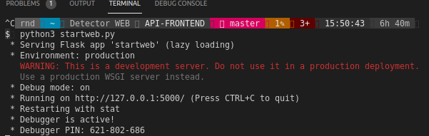
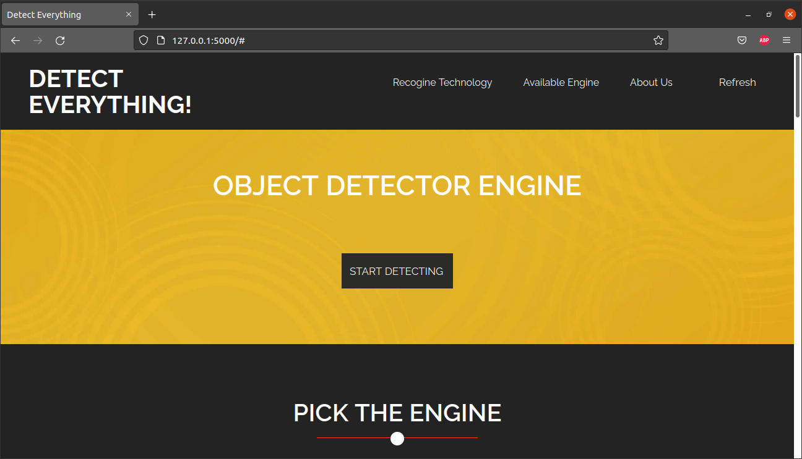
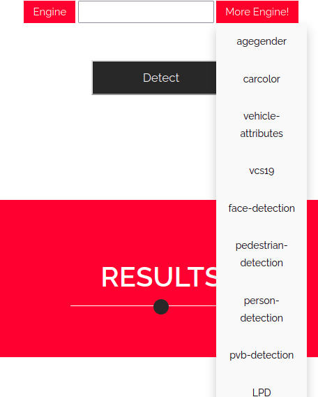
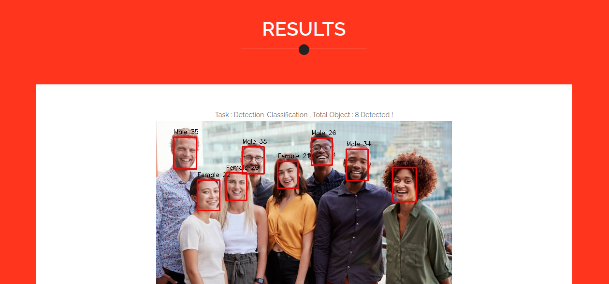
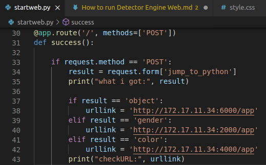
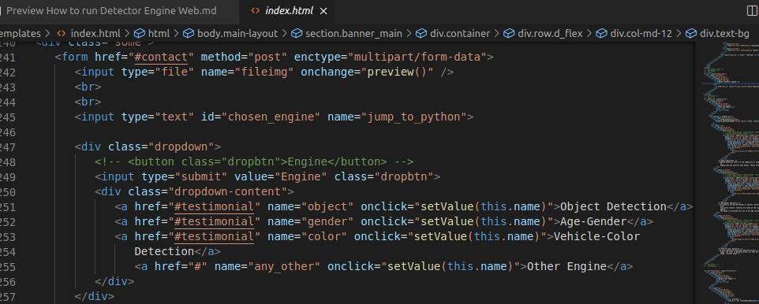

# **HOW TO RUN DETECTOR ENGINE WEB**

### **INTRODUCTION**

1. The goals of this Document is to make the all process for running the websites much easier with showing all the steps from the very first untill the end.

2. This Websites for analyzing and detecting every sample object given is created to make the detecting process easier, so the non programmer also could experience the analyzing and detecting things.

### **Object Detector Engine**

1. Make sure you already have python3 install on your personal computer.
2. Make sure also that you already have the sample pictures to detect soon.
3. All the detecting process will work if the endpoint active already.
4. Run the endpoint (starting the API) :

    ```sh
    python3 gadAPI.py (Run on your API file on terminal)
    ```

5. While the endpoint actived, you could start to run the websites, the websites folder is include the Python file and all the Assets & Templates for websites :

    ```sh
    python3 startweb.py
    ```

    It is should be look like this (if there is no error occured) :
    

6. Run the Websites on your browser by using the URL given :

    ```sh
    http://127.0.0.1:5000/
    ```

7. This will appear on your browser if you run the URL given :
    

8. By default, this API Frontend 3 original Engine, but More API Engine will be available depends on the Gateway checking everytime the websites is running.
    

9. All the flow of the websites are easy to follow.

10. This is the how the result will looks like :
    

11. While finish all the steps already, remember to stop all the active endpoint :

    ```sh
    ^C (Ctrl + C on your terminal)
    ```

<!-- ## **Adding another Endpoint**

1. For example, you want to add another endpoint ('http://172.17.11.34:9000/app')

2. Open your startweb.py, and go to this section :

    
3. Add another " Else-If " :

    ```sh
    elif result == 'any_other':
        urllink = 'http://172.17.11.34:9000/app'
    ```

4. The "name" ("any_other") should be match with "result" on Python, in this case will be "any_other".

    ```sh
    <a href="#" name="any_other" onclick="setValue(this.name)">Other Engine</a>
    ```

     -->
